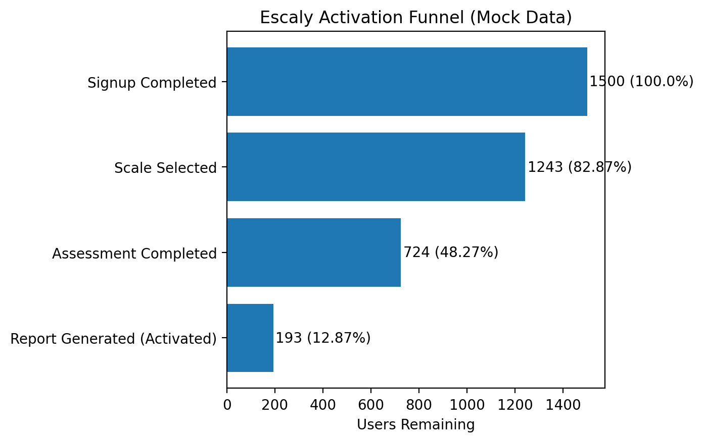

# Case Study — Escaly Activation Funnel

## 🎯 Context
Escaly helps organizations measure and improve capabilities using structured frameworks (“scales”).  
The product delivers value when a user completes an assessment and generates a report.  
This case study defines how Escaly would **measure its activation funnel** prior to launch — setting a baseline for later PLG experiments.  

---

## 🛠 Problem
New users often sign up but fail to reach their **first value moment** (report generation).  
Without reliable activation, users are unlikely to return, retain, or upgrade.  
Escaly needs a clear definition and measurement of its activation funnel to identify drop-offs and cohort differences.  

---

## 📐 Hypothesis
If users can smoothly progress from signup to report generation within their **first session**, activation rates will be higher.  
By measuring this journey, Escaly can establish a baseline and understand friction points.  

- **North Star metric:** % of new signups who generate a report in their first session (`activation_rate_session1`).  
- **Activation event:** `generate_report`.  

---

## 📊 Experiment / Measurement
**Funnel Definition**
1. `signup_completed` → Account created & verified  
2. `select_scale` → User chooses framework  
3. `submit_assessment` → Assessment completed  
4. `generate_report` → First report generated (activation)  

**Metrics**
- Activation rate (Session 1)
- Time to activation (median, in minutes)
- Drop-off rates at each funnel step
- Cohort and segment comparisons

**Cohorts**
- Acquisition channel (`organic`, `paid_search`, etc.)  
- Plan tier (`free`, `pro`, `business`)  

**Data**
- Synthetic dataset generated with [`generate_mock_data.py`](./generate_mock_data.py).  
- Output saved in [`mock_data.csv`](./mock_data.csv).

---

## 📈 Results (Mock Data)

### Funnel Conversion (Signup → Report)
| Step                        | Users Remaining | Conversion % |
|-----------------------------|-----------------|--------------|
| Signup Completed            | 1,500           | 100.00%      |
| Scale Selected              | 1,243           | 82.87%       |
| Assessment Completed        |   724           | 48.27%       |
| Report Generated (Activated)|   193           | 12.87%       |

**Figure 1:** Activation funnel visualization


---

### Time to Activation (All Users)
| Activated Users | Median TTA (min) | Mean TTA (min) | Min | Max |
|-----------------|------------------|----------------|-----|-----|
| 193             | 18.0             | 18.42          | 9   | 30  |

---

### Time to Activation by Segment
| Channel      | Plan Tier | Activated Users | Median TTA (min) | Mean TTA (min) |
|--------------|-----------|-----------------|------------------|----------------|
| direct       | business  | 1               | 22.0             | 22.00          |
| direct       | free      | 4               | 22.5             | 22.00          |
| direct       | pro       | 8               | 22.5             | 22.50          |
| email        | business  | 7               | 17.0             | 18.00          |
| email        | free      | 18              | 17.5             | 19.06          |
| email        | pro       | 7               | 23.0             | 21.57          |
| organic      | business  | 12              | 22.0             | 21.17          |
| organic      | free      | 57              | 16.0             | 17.51          |
| organic      | pro       | 20              | 15.5             | 18.75          |
| paid_search  | business  | 4               | 12.5             | 15.75          |
| paid_search  | free      | 20              | 16.0             | 16.10          |
| paid_search  | pro       | 7               | 18.0             | 17.57          |
| referral     | business  | 3               | 16.0             | 18.33          |
| referral     | free      | 17              | 21.0             | 18.24          |
| referral     | pro       | 8               | 20.0             | 18.25          |

---

## 💡 Insights
- Only **12.9% of signups** reach first value in Session 1 → activation is the biggest bottleneck.  
- The steepest drop-off happens at the **assessment step** (724 complete vs. 1,243 scale selections).  
- **Organic/free users** activate faster (median ~16 min) than **direct/business users** (~22 min).  
- Paid search has lower activation and slower times, indicating possible **lower intent traffic**.  

---

## 🚀 Next Steps
- Optimize the **assessment step** (reduce friction, shorten time).  
- Explore tailored onboarding by **plan tier** (business users slower but high-value).  
- Investigate acquisition channels — especially **paid search underperformance**.  
- Use this baseline to design **growth experiments**.

---

## 🔑 Why It Matters for PLG
Activation is the **gateway metric** in product-led growth:  
- Without activation, retention and monetization cannot compound.  
- Instrumenting the activation funnel now ensures future experiments are measurable.  
- Cohort-based insights provide a foundation for scalable PLG strategies.  

---

## 📂 Supporting Artifacts
- **Tracking Plan:** [`../../tracking-plan-escaly/events.v1.0.0.json`](../../tracking-plan-escaly/events.v1.0.0.json)  
- **Business Logic:** [`../../business-logic-escaly/business-logic.md`](../../business-logic-escaly/business-logic.md)  
- **SQL — Funnel:** [`./funnel.sql`](./funnel.sql)  
- **SQL — Time to Activation:** [`./time_to_activation.sql`](./time_to_activation.sql)  
- **SQL — Time to Activation by Segment:** [`./time_to_activation_by_segment.sql`](./time_to_activation_by_segment.sql)  
- **Dataset Generator:** [`./generate_mock_data.py`](./generate_mock_data.py)  
- **Mock Dataset:** [`./mock_data.csv`](./mock_data.csv)  
- **Figures:** [`./activation-funnel.png`](./activation-funnel.png)  

---

## 🖥 How to Run the Analysis

1. **Install dependencies:**
   ```bash
   pip install duckdb pandas matplotlib tabulate --quiet
   ```

2. **Generate mock dataset (optional):**
    ```bash
    python case-studies/escaly-activation-funnel/generate_mock_data.py --n_users 1500 --out case-studies/escaly-activation-funnel/mock_data.csv
    ```

3. **Run funnel analysis:**
    ```bash
    python - <<'PY'
    import duckdb, pathlib, pandas as pd
    con = duckdb.connect()
    con.execute("CREATE OR REPLACE TABLE mock_events AS SELECT * FROM read_csv_auto('case-studies/escaly-activation-funnel/mock_data.csv', HEADER=TRUE);")
    sql = pathlib.Path('case-studies/escaly-activation-funnel/funnel.sql').read_text()
    print(con.execute(sql).fetchdf().to_markdown(index=False))
    PY
    ```

4. **Run time-to-activation analysis:**
    ```bash
    python - <<'PY'
    import duckdb, pathlib, pandas as pd
    con = duckdb.connect()
    con.execute("CREATE OR REPLACE TABLE mock_events AS SELECT * FROM read_csv_auto('case-studies/escaly-activation-funnel/mock_data.csv', HEADER=TRUE);")
    sql = pathlib.Path('case-studies/escaly-activation-funnel/time_to_activation.sql').read_text()
    print(con.execute(sql).fetchdf().to_markdown(index=False))
    PY
    ```

5. **Run segmented time-to-activation:**
    ```bash
    python - <<'PY'
    import duckdb, pathlib, pandas as pd
    con = duckdb.connect()
    con.execute("CREATE OR REPLACE TABLE mock_events AS SELECT * FROM read_csv_auto('case-studies/escaly-activation-funnel/mock_data.csv', HEADER=TRUE);")
    sql = pathlib.Path('case-studies/escaly-activation-funnel/time_to_activation_by_segment.sql').read_text()
    print(con.execute(sql).fetchdf().to_markdown(index=False))
    PY
    ```
