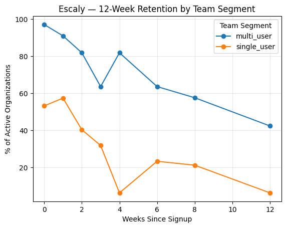

# Case Study — Escaly Retention Cohorts

## 🎯 Context
This case study is part of the *Product Manager Technical Skills & PLG Portfolio*.

The goal is to analyze **retention behavior in Escaly**, a B2B SaaS platform that digitalizes psychosocial assessments for social organizations.

The study explores how *team adoption*—the number of professionals actively using Escaly within the same organization—affects 12-week retention.

---

## 🛠 Problem
- Early Escaly usage often remains limited to one enthusiastic professional within an organization.
- Without collaborative use, the platform’s full value—shared data, standardized reporting, and collective decision-making—never materializes.  
- Churn analysis showed that most inactive accounts had only one active user.  
- Escaly’s mission is inherently collaborative: assessments are interpreted, discussed, and followed up by multidisciplinary teams.  
- Understanding how early multi-user adoption influences long-term retention is essential to improve onboarding and expansion strategy.

---

## 📐 Hypothesis
> Organizations where **two or more professionals become active during the first 4 weeks after signup** will show **significantly higher 12-week retention** than organizations with only one active user.

Rationale:
- Collaboration transforms Escaly from an individual tool into a shared workflow.  
- Peers reduce friction by modeling correct use and reinforcing digital habits.  
- Once multiple users depend on shared data, the perceived switching cost increases.

In PLG terms, *team activation* is Escaly’s equivalent of a **collaboration loop**—similar to inviting teammates in Notion or Miro—and should correlate with sustained engagement.

---

## 📊 Measurement
**Cohort definition**  
- Cohorts grouped by `signup_week` (organization-level).  
- Observation window: 12 weeks post-signup.  

**Retention metric**
- % of organizations with ≥ 1 active user in week _n_.  

**Segmentation**
- **Single-user orgs:** 1 active user by week 4  
- **Multi-user orgs:** ≥ 2 active user by week 4

**Note:**
While Escaly plans to track invitation and sharing events (`user_invited`, `report_shared`) in later phases, this analysis focuses solely on observed collaboration rather than invitation intent.

---

## Technical Specification
The detailed tracking plan for this analysis is documented separately in:  
[`tracking-plan-extension.md`](./tracking-plan-extension.md)

This supporting file outlines the event schema, governance alignment, and measurement logic for the extended tracking plan that enables team-based retention analysis.

---

## 📈 Results (Mock or Real Data)

### 12-Week Retention by Team Segment

**Retention Curve (mock data)**  


The figure above shows the 12-week retention trajectories for single-user vs. multi-user organizations. Multi-user accounts maintain engagement far longer, while single-user organizations rapidly decay within the first month.

---

### Weighted Retention by Cohort Size

| Cohort Type | Week 1 | Week 4 | Week 8 | Week 12 |
|--------------|--------|--------|--------|---------|
| Single-user orgs (n = 47) | 57.4 % | 6.4 % | 21.3 % | 6.4 % |
| Multi-user orgs (n = 33) | 90.9 % | 81.8 % | 57.6 % | 42.4 % |

### Interpretation

- **Early Engagement Gap (Week 1).** Multi-user organizations retain nearly twice as many active accounts in the first week (90.9 %) compared with single-user accounts (57.4 %). Collaboration clearly accelerates early value realization.
- **Critical Divergence (Week 4).** By week 4, single-user organizations collapse to 6.4 % retention while multi-user orgs still hold 81.8 %. → This marks the activation-retention inflection point: if teamwork hasn’t formed within the first month, churn risk becomes extreme.
- **Mid-Term Stability (Weeks 6–8).** Multi-user orgs level off around 60 %, a healthy plateau typical of engaged SaaS teams.
Single-user orgs show minor bumps (≈ 20 %) from sporadic re-use but lack sustained patterns.
- **Long-Term Retention (Week 12).** After three months, 42 % of multi-user organizations remain active versus only 6 % of single-user ones — a 7× retention advantage driven by team adoption.

---

## 💡 Insights
1. **Team adoption drives retention.**  
   Escaly’s stickiness emerges once it becomes a shared workflow, not an individual tool.  

2. **Peer influence accelerates digital adoption.**  
   Internal champions succeed when they onboard at least one colleague early—social proof lowers resistance to change.  

3. **Product implication.**  
   Onboarding should explicitly nudge first users to *invite a teammate* and *complete an assessment together*.  
   Collaboration is not a side feature; it’s the retention engine.

---

## 🚀 Next Steps
  Future PLG experiments should test:  
  - Auto-prompting invites during first assessment  
  - Shared dashboards and activity notifications  
  - Usage badges (“2 of your colleagues are active this week”)  

---

## 🔑 Why It Matters for PLG
- **Collaboration = Growth loop.**  
  “Invite → Collaborate → Retain” defines Escaly’s compounding engine. Each invitation extends the product’s reach inside an organization.  

- **Monetization readiness.**  
  Team retention validates a shift from single-seat trials to tiered, organization-based subscriptions—the foundation for scalable ARR.  

- **Efficient growth.**  
  A +32 pp increase in team activation can translate into +36 pp improvement in week-12 retention, boosting LTV without new acquisition spend.

---

## 📂 Supporting Artifacts

| Type | File / Folder | Description |
|------|----------------|-------------|
| **Mock Data** | [`data/events.csv`](./data/events.csv) | Synthetic dataset simulating Escaly organizations, users, and weekly activity events. |
| **SQL Queries** | [`sql/00_setup_and_transforms.sql`](./sql/00_setup_and_transforms.sql)<br>[`sql/01_retention_analysis.sql`](./sql/01_retention_analysis.sql) | DuckDB SQL scripts to create derived tables and compute 12-week retention cohorts. |
| **Python Scripts** | [`scripts/generate_mock_data.py`](./scripts/generate_mock_data.py)<br>[`scripts/run_retention_experiment.py`](./scripts/run_retention_experiment.py) | Utilities to generate mock events, run the full experiment, and export results/figures. |
| **Tracking Plan Extension** | [`tracking-plan-extension.md`](./tracking-plan-extension.md) | Additive events and derived signals supporting team-based retention measurement. |

---

## 🖥 How to Run the Analysis

1. **Generate mock dataset (optional):**
    ```bash
    python case-studies/escaly-retention-cohorts/generate_mock_data.py \
      --accounts 100 \
      --weeks 12 \
      --out case-studies/escaly-retention-cohorts/data/events.csv
    ```

2. **Run setup and retention analysis:**

    ```bash
    python case-studies/escaly-retention-cohorts/scripts/run_retention_experiment.py
    ```
