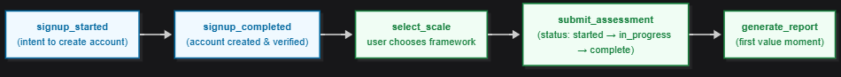

# Tracking Plan — Escaly

## 🎯 Purpose
This folder defines the **event instrumentation schema** for Escaly.  
It ensures product interactions are tracked consistently to support **acquisition, activation, retention, and monetization analysis**.

The plan is implemented in code (JSON + schema) to provide version control, validation, and transparency — mirroring how modern SaaS teams manage analytics contracts.

---

## 📂 Contents
- **events.json** → Canonical event definitions (signup, assessment, report generation).  
- **governance.md** → Rules for naming, ownership, data quality, and PII handling.  
- **about-tracking-plan.md** → Rationale and overview of why this plan was designed this way.  
- **diagrams/** → Visual flow diagrams of onboarding and reporting funnels.  

---

## 📊 Acquisition → Activation Flow

This flow diagram illustrates the **Acquisition → Activation funnel** for Escaly.  
It shows the key product events in order — from signup to first report — and highlights where users may drop off.  
While `events.json` defines the schema in detail, the diagram provides a quick visual overview of the funnel being instrumented and analyzed in case studies.

---

## Repo Flow

This diagram shows how the tracking plan sits between  
**business logic** (conceptual definitions) and **case studies** (insights).
